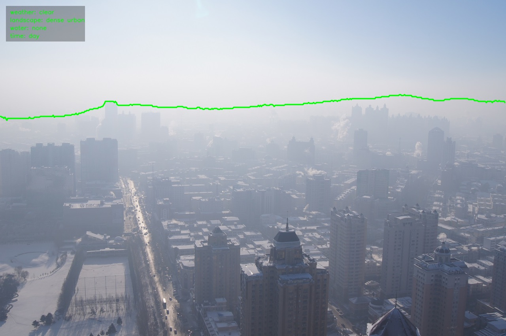

# Horizon Detection (C++)

This is a C++ port of my Python horizon detection code, using OpenCV, Eigen, TensorFlow, and DenseCRF.

TensorFlow is built monolithically with Bazel and rather than clone the entire TensorFlow repo, the files here just need to be copied:

- clone tensorflow
- append the WORKSPACE file to tensorflow's WORKSPACE
- copy the files in this directory into the corresponding tensorflow directories
- build tensorflow

Binaries can then be found in the correspondong Bazel output folder.

